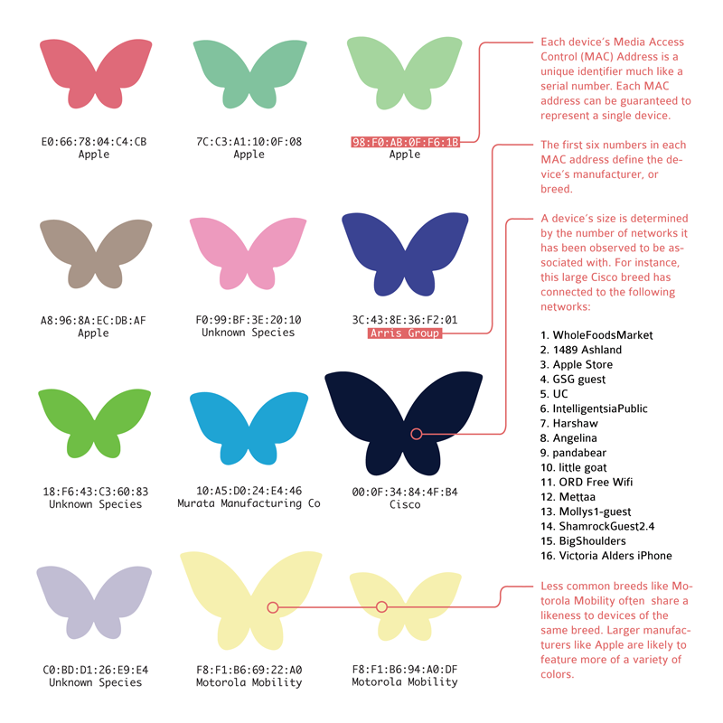

# [Probe Kit](http://probekit.io)

"A must-have hobby kit for any amateur network data collection."

E-mails, instant messages, videos, photos, voice chats, social network profile details ¹ and other file transfers are floating all around us everyday in the form of network datagrams ². While most of us have little appreciation for this, some of us are born with the irresistible urge ³ to capture all this data! If this is you, there’s a chance you haven’t started a personal collection of network data because of the fancy equipment ⁴ required or the expense of storing ⁵ it all. Fear not! Introducing Probe Kit™, designed for amateur and hobby network data collectors interested in getting started. No need to make secret deals ⁶ with large Internet companies, with our kit you can start your own network data collection from the comfort of your own desktop! Probe Kit™ is an all-in-one starter kit for collecting probe requests, one of the fluttering data packets from wireless devices out in the wild.



## Download and Install

The latest version of Probe Kit can be downloaded from the [project website](http://probekit.io) or from this GitHub [releases page](https://github.com/brannondorsey/ProbeKit/releases). Once you've downloaded Probe Kit, pick an install method that works best for you (see below).

Currently Probe Kit is supported on OS X and Linux only.

### Easy Install

Open your Terminal application (Terminal.app for OS X) and navigate to your downloaded folder. If you've never used the Terminal before, don't worry! Type `cd path/to/your/downloaded/folder` (using your downloaded folder of course) and then press return.

Next run the install script with:

```
sudo ./install.sh
```

At which point you will be prompted to enter your password. You probably won't see your password being entered as you type (this is a security feature), but don't worry it is listening for your keypresses. While the install script is running you will be prompted to answer a few questions. For the easy install, type `y` and press return to continue. A few other windows might pop-up asking for you to enter your password again or to confirm an installation process.

Once the installation is complete you should see:

```
[install.sh] Probe Kit was installed successfully! You may now open Probe Kit.
```

If this is not printed to the screen or there was a problem with the install you can [submit an issue](https://github.com/brannondorsey/ProbeKit/) and we will do all that we can to answer your questions and help with the install process. If the install script failed you may have better luck with the [manual install](https://github.com/brannondorsey/ProbeKit/).

If everything was successful you are now ready to move on to the [Getting Started](#getting-started) section.

### Manual Install

To install Probe Kit manually, you must first install MongoDB and Wireshark yourself. Both of their websites should have the necessary instructions for doing so. Once Wireshark is installed you must setup your capture privileges with:

```
sudo ./shell/setup_capture_privileges.sh
```

Now run

```
sudo ./shell/generate_settings.sh
```

to create a `.probekit` folder in your `$HOME` directory. Finally, if you want to download the geotagged wifi network data and map packs for Miami, FL (more cities coming soon!), run:

```
sudo ./shell/custom_hooks/hook_install_done.sh
```

### Source Code Install

For you brave souls out there...

```bash
git clone https://github.com/brannondorsey/ProbeKit.git
cd ProbeKit/node
npm install
sudo npm install -g nw
sudo npm install -g node-webkit-builder
cd ../shell
sudo ./build osx64 #comma-seperated list of build platforms, see node-webkit-builder docs
cd "../build/Probe Kit/osx64/"
sudo ./install.sh
open "Probe Kit.app" # OS X only
```

### Source Code Install with Virtualenv

That is for you minimalist guy...

```bash
sudo apt-get install libpcap-dev virtualenv mongodb tshark
sudo -E useradd -G wireshark $USER
git clone https://github.com/brannondorsey/ProbeKit.git
cd ProbeKit/
virtualenv -p python3 ._env
source ._env/bin/activate
pip install nodeenv
nodeenv --python-virtualenv
npm install node/
./shell/generate_settings.sh
```
To run web server and upload server.

```bash
node node/server.js -i <wireless interface> &
node node/upload_server.js &

```

## Getting Started

## License and Attribution

Probe Kit is built and maintained by [Nick Briz](http://nickbriz.com) and [Brannon Dorsey](http://brannondorsey.com) with support from [Branger_Briz](http://brangerbriz.com).

All original Probe Kit code is released under an [LICENSE](MIT License) and may be used, copied, modified, published, distributed, sublicensed, and/or sold freely.

Probe Kit is built using the following libraries and projects:

- [Wireshark](https://www.wireshark.org/)
- [Node.js](https://nodejs.org/)
- [NW.js](http://nwjs.io)
- [WiGLE.net](https://wigle.net)
- [MapBox](https://www.mapbox.com/)
